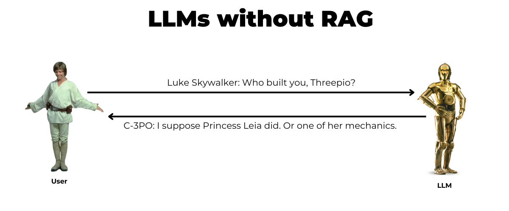
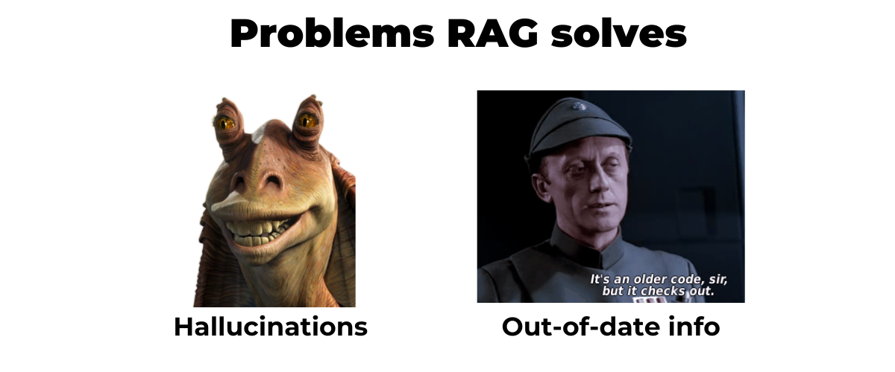

# RAG Project

Système de Retrieval-Augmented Generation (RAG) entièrement local. Une base de
connaissances vectorielle (pgvector) est interrogée pour fournir un contexte à un
modèle de langage (Ollama / llama3.1), de manière à produire des réponses fondées
sur les documents fournis et accompagnées de leurs sources.

Aucune donnée ne quitte la machine : génération et embeddings sont exécutés en local,
sans clé d'API ni service externe.





## Architecture

Deux conteneurs Docker (images officielles) et des scripts Python.

```
  Documents (.md/.txt ou dataset)
          |
          v
  ingest.py  --embeddings bge-m3-->  pgvector (table chunks, vector(1024))
                                              ^
  Question --embeddings bge-m3--> recherche cosinus (<=>) -- top-k --+
          |                                                          |
          v                                                          |
  query.py  --contexte + question-->  Ollama / llama3.1  -->  reponse + sources
```

- Base vectorielle : `pgvector/pgvector:pg16` (PostgreSQL avec extension `vector`).
- Moteur d'inférence : `ollama/ollama:0.30.11`.
- Embeddings : `bge-m3` (dimension 1024).
- Génération : `llama3.1:8b`.

## Environnement

- Machine hôte : macOS ou Linux.
- Virtualisation / déploiement : Docker (les images officielles ci-dessus). Sur macOS,
  Docker Desktop exécute les conteneurs dans une machine virtuelle Linux légère.
- Langage : Python 3.11.

Toute la configuration (modèles, dimension, taille de chunk, chaîne de connexion) est
centralisée dans `config.py` et lue par l'ensemble des scripts. La colonne pgvector
`vector(1024)` doit rester cohérente avec la dimension du modèle d'embedding : changer
de modèle impose une ré-ingestion.

## Prérequis

- Docker et Docker Compose (Docker Desktop en cours d'exécution).
- Python 3.11 ou supérieur, avec `venv`.
- `make`.
- Environ 10 Go d'espace disque pour les modèles Ollama.

## Reproduction pas à pas

Toutes les commandes se lancent depuis la racine du dépôt.

### 1. Récupérer le projet

```bash
git clone https://github.com/saraelmoun/RAG_Project-.git
cd RAG_Project-
```

### 2. Créer l'environnement Python

Les cibles `make ingest`, `make query` et `make app` utilisent l'interpréteur `python`
de l'environnement virtuel : celui-ci doit être activé au préalable.

```bash
python3 -m venv .venv
source .venv/bin/activate
pip install --upgrade pip
pip install -r requirements.txt
```

### 3. Démarrer l'infrastructure

Docker Desktop doit être lancé.

```bash
make up
```

Cette commande démarre les deux conteneurs (`db` et `ollama`). Au premier démarrage,
`db/init.sql` crée l'extension `vector` et la table `chunks`.

Vérification :

```bash
docker compose ps
docker compose exec db psql -U rag -d ragdb -c "\dx"        # extension vector active
docker compose exec db psql -U rag -d ragdb -c "\d chunks"  # table avec embedding vector(1024)
```

Variante avec réservation GPU NVIDIA pour Ollama : `make up-gpu`.

### 4. Télécharger les modèles

```bash
make pull
```

Récupère `bge-m3` (embeddings) et `llama3.1:8b` (génération) dans le conteneur Ollama.
Le téléchargement représente plusieurs gigaoctets et peut prendre du temps.

Vérification :

```bash
curl http://localhost:11434/api/tags
```

### 5. Constituer la base de connaissances

Deux sources possibles, exclusives (chaque ingestion remplace la base) :

- Corpus de fichiers fourni dans `corpus/` :

  ```bash
  make ingest
  ```

  Le script lit `corpus/*.md`, découpe les documents en chunks, calcule les embeddings
  via `bge-m3` et insère le tout dans la table `chunks`. L'opération est idempotente :
  la ré-exécuter ne crée aucun doublon (clé d'unicité sur le hash du chunk).

- Jeu de données `neural-bridge/rag-dataset-12000` : voir l'interface web (étape 7),
  onglet Dataset, qui charge N lignes du jeu de données et permet de comparer les
  réponses générées à la réponse de référence.

Vérification :

```bash
docker compose exec db psql -U rag -d ragdb -c "SELECT source, count(*) FROM chunks GROUP BY source;"
docker compose exec db psql -U rag -d ragdb -c "SELECT vector_dims(embedding) FROM chunks LIMIT 1;"
```

### 6. Interroger en ligne de commande

```bash
make query Q="Quel est le taux de remboursement kilometrique ?"
```

Le script calcule l'embedding de la question, récupère les k passages les plus proches
dans pgvector, construit un prompt contextualisé avec une consigne stricte
(anti-hallucination), puis affiche la réponse générée suivie de ses sources.

### 7. Interface web

```bash
make app
```

Un serveur local est lancé sur le port 7860 :

- `http://localhost:7860/` : page de présentation du projet.
- `http://localhost:7860/app/` : interface d'interrogation (conversation, comparaison
  des réponses avec et sans RAG, affichage des sources, dépôt de documents ou chargement
  du jeu de données).

Laisser le terminal ouvert tant que l'interface est utilisée.

### 8. Réinitialiser

```bash
make reset
```

Arrête les conteneurs et supprime les volumes (base et modèles), afin de repartir d'un
état vierge.

## Cibles make

| Cible          | Effet                                                                 |
| -------------- | --------------------------------------------------------------------- |
| `make up`      | Démarre les conteneurs `db` et `ollama`.                              |
| `make up-gpu`  | Idem avec réservation GPU NVIDIA pour Ollama.                         |
| `make pull`    | Télécharge les modèles `bge-m3` et `llama3.1:8b`.                     |
| `make ingest`  | Ingestion du corpus `corpus/` dans la table `chunks`.                |
| `make query`   | Interrogation en ligne de commande : `make query Q="..."`.           |
| `make app`     | Lance le serveur web (présentation + interface d'interrogation).     |
| `make reset`   | Arrête tout et supprime les volumes.                                 |

## Structure du dépôt

```
config.py               Configuration centrale (modèles, dimension, chunking, connexions)
docker-compose.yml      Définition des conteneurs db (pgvector) et ollama
docker-compose.gpu.yml  Surcouche pour la réservation GPU
db/init.sql             Création de l'extension vector et de la table chunks
ingest/ingest.py        Ingestion : lecture, découpage, embeddings, insertion
query/query.py          Requête : recherche vectorielle, contexte, génération, sources
app.py                  Serveur web et interface Gradio
corpus/                 Documents d'exemple (.md)
results/                Jeu de référence question/réponse
site/                   Page de présentation statique
requirements.txt        Dépendances Python
Makefile                Cibles de reproduction
```

## Remarques

- Activer l'environnement virtuel (`source .venv/bin/activate`) avant `make ingest`,
  `make query` ou `make app`, faute de quoi l'interpréteur `python` ne sera pas trouvé.
- Le premier appel au modèle de génération inclut son chargement en mémoire ; les appels
  suivants sont plus rapides.
- Ports utilisés : 5432 (PostgreSQL), 11434 (Ollama), 7860 (interface web).
